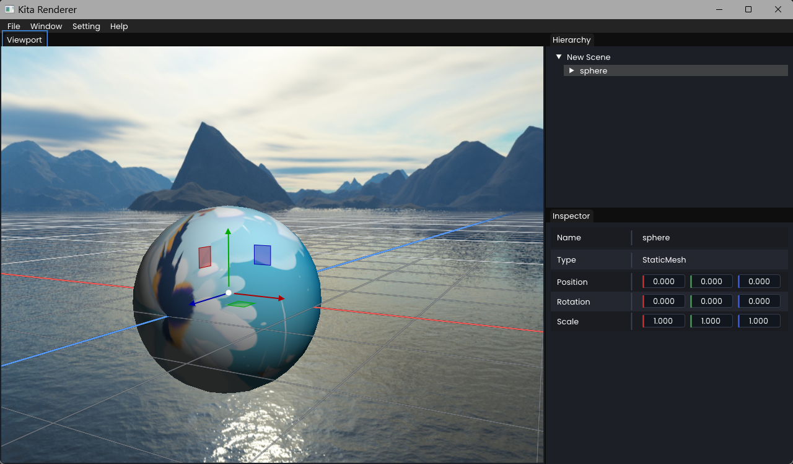

# Kita




## ���ٿ�ʼ

### ����Ҫ��

- Windows 10/11
- Git
- Visual Studio 2022/2026������ C++ ���濪�������

### ��¡��Ŀ��������ģ�飩

```powershell
git clone --recurse-submodules https://github.com/NiKuliCat/Kita.git
cd Kita
```

����ֿ��Ѿ���¡��û����ȡ��ģ�飬��ִ�У�

```powershell
git submodule update --init --recursive
```

### ���ɹ����ļ�

```powershell
.\Setup.bat
```

Ĭ������ VS2026 ���̡�Ҳ������ʽָ���汾��

```powershell
.\Setup.bat 2022
.\Setup.bat 2026
```

�ȼ�д����

```powershell
.\Setup.bat vs2022
.\Setup.bat vs2026
```

ִ�к������ `Kita.slnx` ���������

### ������Debug | x64��

```powershell
& "G:\IDE\VS2026\application\MSBuild\Current\Bin\MSBuild.exe" ".\Kita.slnx" /m /p:Configuration=Debug /p:Platform=x64
```
